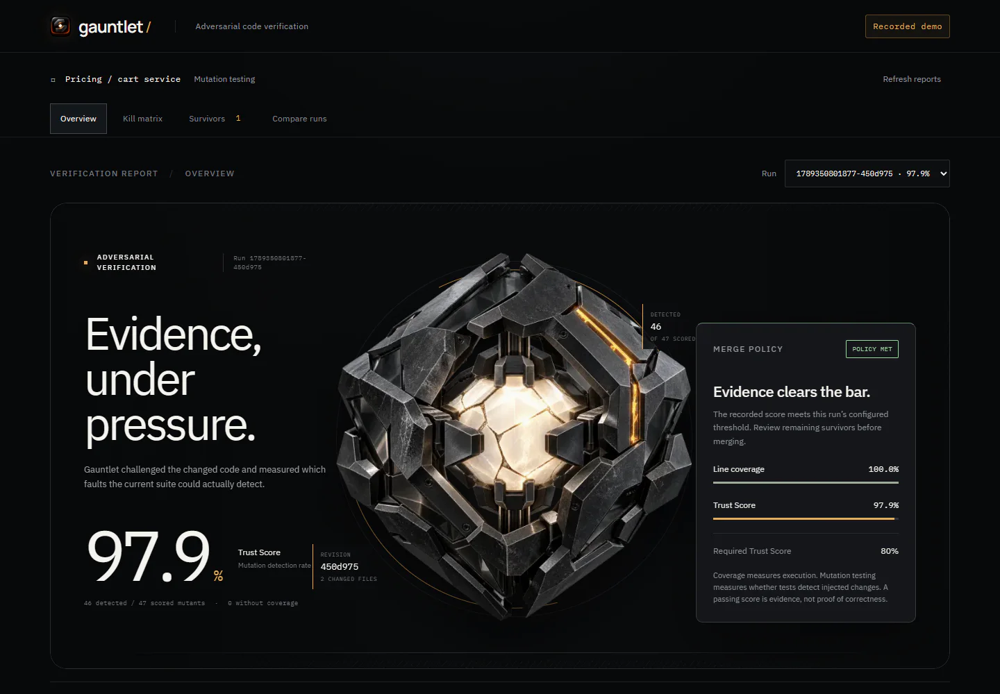

<p align="center">
  
</p>

<h1 align="center">Gauntlet</h1>

<p align="center"><strong>Test the tests guarding AI-written code.</strong></p>

Gauntlet runs StrykerJS mutations against changed TypeScript/JavaScript files, records which changes the tests detect, and presents a Trust Score beside measured line coverage. Surviving mutations become a handoff for IBM Bob to strengthen tests. A CLI gate checks the resulting evidence against a threshold.

<p align="center">
  
</p>

## Reproduce the demo

Requires Go 1.22+ and Node.js 24. The pinned demo uses StrykerJS 10 and Vitest 5.

```sh
npm ci --prefix demo-repo
go run ./cmd/gauntlet --repo demo-repo init

# Real weak-suite baseline against the committed demo source.
go run ./cmd/gauntlet --repo demo-repo run --changed --base-ref d1f85d4 --trigger manual
go run ./cmd/gauntlet --repo demo-repo gate --min-score 80

# Additive boundary tests; the original weak tests still run.
go run ./cmd/gauntlet --repo demo-repo run --changed --base-ref d1f85d4 --test-command "npm run test:strong" --trigger manual
go run ./cmd/gauntlet --repo demo-repo gate --min-score 80
```

The bundled recorded pair contains the same 47 mutants at 100% line coverage: the weak suite scored 74.5% and failed the 80% policy; the strong suite scored 97.9% and passed. Mutation outcomes can vary slightly between runs, so treat the committed artifacts as reproducible evidence, not hard-coded expected output.

## Dashboard

Requires Node.js 24 and npm. The dashboard reads local JSON artifacts and supports bundled recorded demo runs without an agent or external service.

```sh
cd dashboard
npm ci
npm run dev
```

Open http://127.0.0.1:3000. Overview shows the policy result; Kill matrix opens individual mutant diffs; Survivors filters outcomes; Compare runs shows before/after evidence.

To read a project outside this repository, set `GAUNTLET_RUNS_DIR` to its absolute `.gauntlet/runs` directory. An explicitly configured missing or corrupt directory produces an error rather than substituting demo data.

```powershell
$env:GAUNTLET_RUNS_DIR = 'F:\path\to\project\.gauntlet\runs'
npm run dev
```

## Score semantics

Raw killed, timeout and survived counts are disjoint. Trust Score is `(killed + timeout) / (killed + timeout + survived) × 100`, rounded to one decimal. No-coverage mutants are reported separately and excluded from this denominator. No scored mutants means no score, never an automatic pass. A high score does not establish correctness; review uncaught behavior, no-coverage cases, timeouts and equivalent mutants.

Line coverage comes from a measured coverage report or is displayed as unavailable. It is never inferred from the mutation score.

## How IBM Bob 2.0 is used

Gauntlet connects three Bob extension points to the mutation loop:

1. `gauntlet init` patches the documented `Stop` lifecycle hook without replacing existing user hooks. Bob finishing a task can trigger a mutation run scoped to changed source files.
2. Surviving mutations are written to `.gauntlet/survivors.md`, which gives the bundled `strengthen-tests` Skill exact files, lines, operators, and behavior gaps to address.
3. `gauntlet strengthen` can invoke a configured non-interactive Bob command, verify the resulting file changes, rerun mutation testing, and report a comparable before/after score. `gauntlet gate` separately enforces the configured merge threshold against the stored run.

Bob is not bundled. The actual IBM executable was unavailable on the development machine, so live agent execution remains a separate verification step. `strengthen --prepare-only` demonstrates the handoff without claiming that Bob ran.

Official references: [Bob lifecycle hooks](https://bob.ibm.com/docs/ide/configuration/lifecycle-hooks), [Bob non-interactive sessions](https://bob.ibm.com/docs/shell/getting-started/start-bobshell-non-interactive), [Stryker configuration](https://stryker-mutator.io/docs/stryker-js/configuration/).

## Development

```sh
cd dashboard
npm test
npm run typecheck
npm run build
npx playwright install msedge
npx playwright test
```

Implementation status and integration results are maintained in [PROGRESS.md](PROGRESS.md). Shared interfaces are in [docs/SCHEMA.md](docs/SCHEMA.md); dependencies are recorded in [docs/DEPENDENCIES.md](docs/DEPENDENCIES.md). Dashboard framework was updated from the early Next.js 14 plan to supported Next.js 16.

Known limits: live IBM Bob execution has not been verified on this machine; `strengthen --prepare-only` is the honest handoff-only path. Two moderate advisories remain in Stryker's development-only transitive dependency chain. Dashboard dependencies audit clean.

MIT © Im-A-Nuel.
